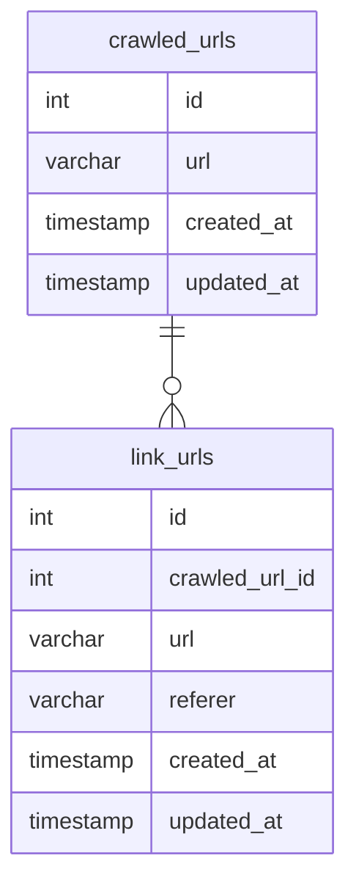

# クローリングアプリ

## batch
指定のサイトをクローリングしてサイト情報をDBに保存する。

## rest
クローリングしたサイト情報を提供するRest API.

## grpc
クローリングしたサイト情報を提供するgRPCサーバー.

## graphql
クローリングしたサイト情報を提供するgraphqlサーバー.

## ER図

```mermaid
erDiagram

crawled_urls ||--o{ link_urls : ""

crawled_urls {
  int id
  varchar url
  timestamp created_at
  timestamp updated_at
}

link_urls {
  int id
  int crawled_url_id
  varchar url
  varchar referer
  timestamp created_at
  timestamp updated_at
}
```
